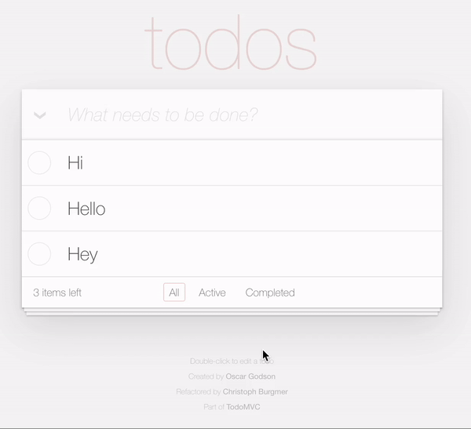
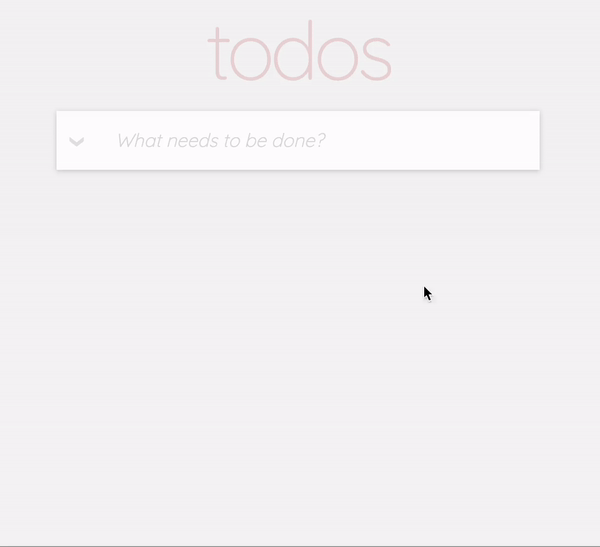

## Todo List

### 요구사항

- 사용자는 할 일을 추가할 수 있습니다.
- 할 일은 체크 on/off가 가능합니다.
- 체크는 모두 on/off를 할 수 있습니다.
- 할 일 내용의 편집과 삭제도 가능해야 합니다.
- 아직 하지 않은 일과 한 일을 구분할 수 있어야 합니다.
- 할 일에 보관된 데이터는 브라우저를 종료해도 보관이 되어야 합니다.

### 학습내용

- 데이터 생성, 편집, 삭제 (CRUD)
- 사용자 입력 검증 (Form Validation)
- LocalStorage와 같은 Stroage API

### 개선사항

- 비슷한 디자인을 위해 선택 및 토글 애니메이션을 삽입했습니다.
- 빈 문자도 입력받는 문제를 해결하였습니다.
- 요구사항을 만족하면서 부가 기능을 구현하였습니다.

### 기능구현

| 원본페이지                      | 구현페이지                       |
| ------------------------------- | -------------------------------- |
|  |  |
